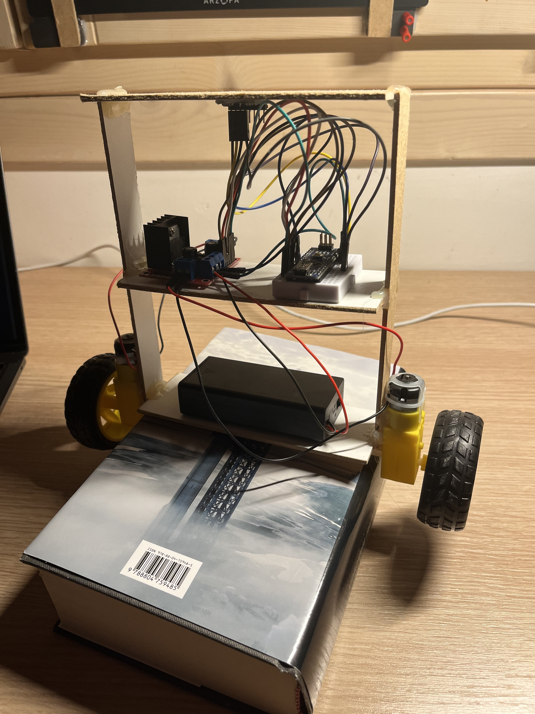

# Balancing Robot

This project is an Arduino-based self-balancing robot that utilizes an MPU6050 accelerometer and gyroscope, an L298N motor driver, and a PID controller to maintain an upright position. The robot constantly reads its tilt angle and corrects its position by adjusting motor speed and direction.

## Features

- **Self-Balancing**: The robot automatically balances itself by adjusting the motors based on tilt angle data.
- **PID Control**: A Proportional-Integral-Derivative (PID) controller is implemented to ensure stable and responsive control, keeping the robot upright even with minor disturbances.
- **Kalman Filter**: A Kalman filter is used to stabilize and smoothen the angle measurements by combining data from the gyroscope and accelerometer, providing an accurate angle estimation.

## Components Used

1. **Arduino Board** (e.g., Arduino Uno or Nano): Acts as the main controller, processing sensor data and sending signals to the motors.
2. **MPU6050 Gyroscope and Accelerometer**: Provides real-time tilt and rotational data for precise angle measurement.
3. **L298N Motor Driver**: Controls the speed and direction of the motors based on PID calculations.
4. **DC Motors with Wheels**: Act as the actuators, adjusting the robot's tilt and allowing it to balance.
5. **Power Supply (Battery)**: Provides power to the entire setup.

## How It Works

1. **Angle Measurement with Kalman Filter**:
   - The MPU6050 provides raw data from both the accelerometer and gyroscope.
   - The **Kalman filter** is applied to combine the accelerometer and gyroscope data, providing a more stable and accurate tilt angle. The filter minimizes noise from the accelerometer and compensates for drift in the gyroscope.

2. **Kalman Filter Process**:
   - The Kalman filter operates by predicting the next angle based on the previous state and gyroscope data.
   - It then corrects the angle based on new accelerometer measurements, producing an accurate angle value with minimal noise. This filtered angle is used as input for the PID controller.

3. **PID Control**:
   - The robot uses a **PID controller** to determine the appropriate motor response based on the angle error.
     - **Proportional (P)**: Corrects based on the current angle error.
     - **Integral (I)**: Adjusts for accumulated errors over time to eliminate offset.
     - **Derivative (D)**: Reacts to the rate of change in error, providing damping to avoid oscillations.
   - The PID output is used to control motor speed and direction, applying corrective force to counteract the tilt.

4. **Motor Control**:
   - Based on the PID output, the **L298N motor driver** adjusts the speed and direction of the motors to maintain balance.
   - If the robot tilts forward, the motors spin in a direction to bring it back to the upright position, and vice versa.

## Code Explanation

- **Kalman Filter Implementation**: A dedicated function handles the Kalman filter, processing gyroscope and accelerometer data for an accurate angle estimate.
- **PID Control Loop**: The main loop calculates the PID output and adjusts motor speed accordingly to counteract any tilt.
- **Motor Control Function**: A function that interprets the PID output to control the direction and speed of the motors, depending on whether the robot needs to move forward or backward.

## Setup and Usage

1. Upload the provided `.ino` file to your Arduino board.
2. Connect the MPU6050, L298N motor driver, and motors according to the wiring diagram.
3. Power the system and place the robot on a flat surface.
4. The robot will attempt to balance itself. Adjust PID parameters (`Kp`, `Ki`, `Kd`) if necessary for optimal performance.

## Tuning Tips

- **PID Tuning**: Experiment with `Kp`, `Ki`, and `Kd` values for best stability. Start with a higher `Kp` for responsive control, adjust `Kd` to reduce oscillations, and use `Ki` carefully to correct small persistent angles.
- **Kalman Filter Adjustment**: You can fine-tune `Q_angle`, `Q_bias`, and `R_measure` if you notice instability in the angle reading.

## Future Improvements

- **Surface Adaptability**: Optimize the robot to balance on various surfaces by dynamically adjusting PID values.
- **Battery Monitoring**: Add a feature to monitor battery levels to avoid performance issues due to low power.
- **Obstacle Avoidance**: Enhance the robot with sensors to avoid obstacles or change direction when needed.

This self-balancing robot is a great way to learn about control systems, sensor fusion, and robotics. The Kalman filter and PID controller are both essential components in modern control applications, making this project an educational and practical experience.
